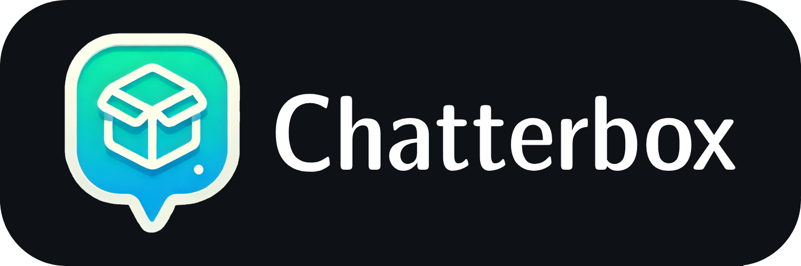
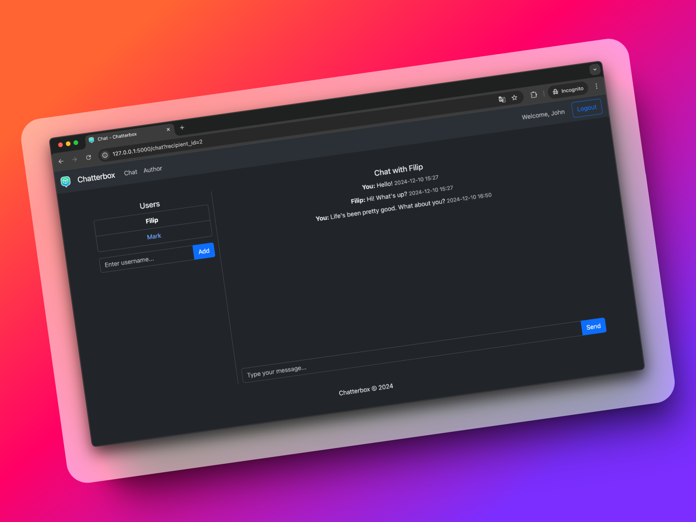

# Chatterbox

<div align="center">
   
</div>

---

<div align="center">
   <b>⚠️⚠️⚠️ CHATTERBOX IS CURRENTLY UNDER ACTIVE DEVELOPMENT, AND THE DOCUMENTATION MAY NOT BE FULLY UP-TO-DATE. LAST DOCUMENTATION UPDATE: 20.12.2024 ⚠️⚠️⚠️</b>
</div>

---

<div align="center">
   
</div>

---

**Chatterbox** is a **lightweight**, **real-time** chat application designed for **seamless** and **reliable** communication. Users can easily **register**, **log in**, and **exchange messages** in a **secure** and **efficient** environment.

Built using **modern technologies**, Chatterbox delivers **stable performance** and **real-time functionality** while maintaining **simplicity** and **ease of use**. Its **intuitive design** focuses on **essential features**, ensuring **quick deployment** and **straightforward maintenance**, making it an ideal solution for various scenarios.

## 📚 Table of Contents
1. [🌟 Features](#-features)
2. [🛠️ Technologies Used](#️-technologies-used)
3. [📦 Installation](#-installation)
   - [Prerequisites](#prerequisites)
   - [Method 1: Docker Setup (Recommended)](#method-1-docker-setup-recommended)
   - [Method 2: Local Setup (Without Docker)](#method-2-local-setup-without-docker)
   - [Method 3: Devcontainer Setup (For Development)](#method-3-devcontainer-setup-for-development)
4. [🧑‍💻 Usage](#-usage)
5. [📂 File Structure](#-file-structure)
6. [🚀 Future Enhancements](#-future-enhancements)
7. [🐞 Known Bugs](#-known-bugs)
8. [📜 License](#-license)
9. [🙏 Acknowledgments](#-acknowledgments)
10. [👤 Author](#-author)

## 🌟 Features

- 🔒 **User Authentication**: Secure registration, login, and logout functionality.
- ⚡ **Real-Time Messaging**: Chat seamlessly with real-time updates.
- 📱 **Responsive Design**: Optimized for monitors of all sizes.
- 🗂️ **Database**: Messages and user data are stored in a robust database.

## 🛠️ Technologies Used

- **Backend**: Python 3, Flask, SQLAlchemy, Socket.IO, Gunicorn, Eventlet, Jinja2
- **Frontend**: HTML, JavaScript, CSS, Bootstrap
- **Database**: SQLite
- **Environment**: Docker, Devcontainers

## 📦 Installation

### Prerequisites

- Python 3.10+
- Docker

### Method 1: Docker Setup (Recommended)

Just run the application using:
```bash
docker compose up -d
```
The application will be accessible at [http://0.0.0.0:8081](http://0.0.0.0:8081).  
To stop the application, run `docker compose down`.


### Method 2: Local Setup (Without Docker)

1. **Install Dependencies (First Run Only)**:
   ```bash
   pip install -r requirements.txt
   ```

2. **Initialize the Database (First Run Only)**:
   ```bash
   python init_db.py
   ```

3. **Run the Application**:
   ```bash
   python app.py
   ```
   The application will be accessible at [http://127.0.0.1:5000](http://127.0.0.1:5000).  
   To stop the application, press `Ctrl + C` in the terminal running the app.

### Method 3: Devcontainer Setup (For Development)

1. Open the project in a development environment that supports Devcontainers (e.g., Visual Studio Code).
2. Follow prompts to build and open the container.
3. The enviroment will be set up automatically based on the `devcontainer.json`.
4. Run `python init_db.py` (first run only), and then `python app.py`.

To stop the application, press `Ctrl + C` in the terminal running the app.

## 🧑‍💻 Usage

1. Open the application in your browser.
2. Register a new user account.
3. Log in using your credentials.
4. Start chatting!

## 📂 File Structure

```
chatterbox/
│
├── app.py                  # Main application logic
├── docker-compose.yaml     # Defines container(s) setup
├── Dockerfile              # Builds the Docker image
├── entrypoint.sh           # Script to initialize the app
├── event_handlers.py       # Event handling logic
├── helpers.py              # Helper functions and decorators
├── init_db.py              # Database initialization script
├── LICENSE                 # Project license
├── models.py               # Database models
├── README.md               # Project documentation
├── requirements.txt        # Python dependencies
├── .gitignore              # Gitignore file
│
├── instance/
│   └── chatterbox.db       # SQLite database file
│
├── misc/                   # Miscellaneous files
│
├── static/                 # Static files
│   ├── favicon.ico         # Favicon
│   ├── logo.png            # Logo image
│   ├── scripts.js          # JavaScript for the website
│   ├── styles.css          # CSS for styling
│   └── websocket.js        # WebSocket JavaScript
│
├── templates/              # HTML templates
│   ├── author.html         # Author information page
│   ├── chat.html           # Chat page template
│   ├── home.html           # Homepage template
│   ├── layout.html         # Base layout template
│   ├── login.html          # Login page template
│   └── register.html       # Registration page template
│
└── .devcontainer/
    └── devcontainer.json   # Dev container configuration
```

## 🚀 Future Enhancements

- **User Profiles**: Add user profile pages and the ability to update account details.
- **Enhanced UI**: Improve the design and usability of the chat interface.
- **React Front-End (Optional)**: Migrate the front-end to React for a more dynamic and modern user experience.

## 🐞 Known Bugs
- The "Users" panel in "Chat" tab does not update in real time when a message is received from someone other than the current chat participant.

## 📜 License

This project is licensed under the MIT License. See the [LICENSE](LICENSE) file for details.

## 🙏 Acknowledgments

- Harvard's CS50x course for inspiration and foundational knowledge.
- The Flask and Bootstrap communities for providing excellent documentation and tools.

## 👤 Author
Filip Rokita  
[www.filiprokita.com](https://www.filiprokita.com/)
